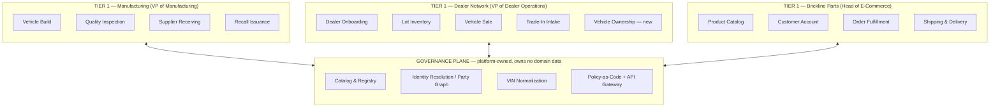

# Artifact 1: Two-Tier Domain Model

*Author: Teddy Desta*

*Two things I wanted right from the start: show what's actually happening inside each domain, not just who owns it, and be explicit about where governance sits instead of hand-waving at it with a sentence at the bottom. Both show up below.*

---

## Tier 1 — Capability Domains

Tier 1 domains are drawn at the level of a real business capability with one accountable executive and one profit and loss (P&L) relevant purpose. That is why "Plant A ERP" and "Plant B ERP" don't get to be their own domains. They're two implementations of the same job, not two jobs.

| Tier 1 Domain | Owner | Rationale |
|---|---|---|
| **Manufacturing (MFG)** | VP of Manufacturing (Plant Data Lead per plant handles day-to-day stewardship) | The only capability that brings a vehicle — and therefore a VIN — into existence. Two plants, two ERPs, but one person accountable for "did we build it right." The plant split is plumbing, not a capability boundary. |
| **Dealer Network (DLR)** | VP of Dealer Operations | Gets a built vehicle into a customer's hands and runs the commercial side of that: dealer relationships, lot inventory, financing, trade-ins. Own revenue line, own 200-dealer DMS mess — genuinely a different job than "build the car" or "sell parts." |
| **Brickline Parts (PRT)** | Head of E-Commerce | Standalone B2B+B2C commerce business on a modern stack. Its customers aren't even all vehicle owners — dealers buy wholesale, independent shops buy parts — and it'd keep running even if Manufacturing stopped tomorrow. That independence is really the whole argument for a separate owner here. |

Three domains. Not two, not four — though I did flip-flop for a bit on whether Parts really deserves its own Tier 1 or should just hang off Dealer Network, since a chunk of its B2B buyers *are* dealers. Landed on separate domain because the P&L and the roadmap are genuinely independent, and that's usually my tiebreaker. Customer and Vehicle are deliberately **not** Tier-1 domains here — see Cross-Domain Entities below for why handing either to a new "master data team" would be exactly the wrong move.

---

## The Governance Plane

The plane is a platform capability, not a domain — it enforces rules and makes things discoverable, but it never gets to be a fourth owner of business data. That's the one rule I'd fight hardest to keep if someone tried to change it later. Concretely: Catalog & Registry, Identity Resolution / Party Graph, VIN Normalization, and Policy-as-Code + API Gateway (detailed in Artifacts 3–4). Policy-as-Code and the API Gateway could also be split into two separate capabilities.  They are bundled here since in practice one team ends up owning both. Down the road, they might split depending on the growth.

Note: On purpose, there's no line drawn between MFG, DLR, and PRT. Every cross-domain fact (a VIN's build spec, who owns a vehicle now, whether a part fits a model) moves through the plane's registered data products, never straight from one domain's database into another's. Two things that's meant to stop: someone writing a script that pulls data straight out of a plant's ERP and pushes it into the DMS, or someone running a nightly export out of Parts and dropping the file on a shared drive so an analyst can open it in Excel (that's Problem 10 in the data pack — it's already starting to happen today). Neither of those shows up as a line on this diagram. If someone actually built one, drawing it honestly would mean adding a brand-new connection straight from one domain box to another — and that connection just isn't part of this design.

---

## Tier 2 — Sub-Domains

Each entry below is a workflow, not a table and not a system — I keep saying this because it's easy to slip back into naming tables out of habit. A workflow has a natural owner and a natural lifecycle. A table is just wherever that workflow happened to dump its output.

### Manufacturing

| Sub-Domain | Workflow | Data-Pack Tie-In |
|---|---|---|
| **Vehicle Build** | Production order → VIN assignment → model/trim/build date | Where VIN gets born. Problems 1 (case), 4 (column naming), 6 (date formats) all have to get sorted out right here before anything downstream can trust it. |
| **Quality Inspection** | QC/defect findings recorded against a VIN | Problem 5 (Inconsistent enum values across systems) — `minor/major/critical` vs. `LOW/MED/HIGH`. These need to reconcile at the point of inspection, not three joins later when nobody remembers which plant said what. |
| **Supplier Receiving** | Parts received into a plant from a supplier | Problem 3 (Supplier ID format incompatibility) — `SUP-001` vs `S_a7b3`, no master supplier directory. This is a little problematic. |
| **Recall Issuance** *(new — doesn't exist in any system today)* | Turning a quality finding into a formal recall record | Problem 8 — recalls today are an email and a spreadsheet. Put it under Manufacturing because only they have the authority to actually declare one, even though every other domain ends up consuming the result. Might deserve its own domain someday if recall volume ever justifies it — not today. |

### Dealer Network

| Sub-Domain | Workflow | Data-Pack Tie-In |
|---|---|---|
| **Dealer Onboarding** | Registering and maintaining the 200 dealer businesses | `dealer_directory.csv` |
| **Lot Inventory** | Tracking built vehicles once they land on a dealer's lot | `inventory_snapshot.csv` |
| **Vehicle Sale** | Matching a dealer customer to a VIN, price, financing | `sales_orders.csv` — this is where the Dealer Customer (`D-XXXXX`) identity actually gets created |
| **Trade-In Intake** | Appraising and receiving a customer's trade-in | `trade_ins.csv` — takes in VINs Brickline never built (BMW, Chevrolet, VW show up in the sample data). See Vehicle/VIN below. |
| **Vehicle Ownership** *(new — the gap in Problem 9)* | Recording who currently holds title to a VIN, updated on every transfer | The specific missing piece blocking the CEO's question. Kind of can't believe this doesn't exist yet, honestly — a build record and its owner go their separate ways the second the vehicle leaves the lot, and nothing reconnects them. |

### Brickline Parts

| Sub-Domain | Workflow | Data-Pack Tie-In |
|---|---|---|
| **Product Catalog** | SKU definitions, vehicle-model compatibility mapping | `product_catalog.json` — `compatible_models` is a second cross-domain seam, tying back to Manufacturing's `model_code` |
| **Customer Account** | B2B and B2C account management | `customers.json` — B2B (dealer bulk buyers) and B2C (individual owners) sharing one table today despite behaving nothing alike. Worth flagging even within Parts' own boundary, not just as a cross-domain issue. |
| **Order Fulfillment** | Cart-to-order lifecycle | `orders.json` — `vehicle_vin_provided` is the *only* voluntary, opt-in bridge a Parts customer has today to say "this is for my car." Free text. Nobody checks it. |
| **Shipping & Delivery** | Carrier handoff, delivery confirmation | `shipping_records.json` |

---

## Cross-Domain Entities

These are the words that mean genuinely different things depending who's saying them, and it's tempting to just give Customer and Vehicle their own row each and call it a day — "owned by whoever," "source of truth, sort of." Not good enough. The rule I'm using instead: each domain keeps owning the record it creates, and the platform links across domains without ever becoming a second owner of either side.

### Customer

- **Dealer Customer** (`D-XXXXX`) — owned by Dealer Network's Vehicle Sale. Created the moment someone finances a vehicle.
- **Commerce Customer** (`CU_xxxxxx`) — owned by Parts' Customer Account. Created at signup, might never buy a thing, and includes B2B dealer accounts that have zero vehicle-owner meaning.

This is the trap, basically everyone falls into it eventually. These look like the same thing because they're both called "customer," but they're not the same. They are two different concepts with two different histories that just happen to share the word "customer". Merging them into one big central Customer record would be exactly the kind of mistake this whole domain-ownership approach is trying to avoid (see `D-12345` / `CU_a7b3c9` — James Patterson, per Problem 2 (Customer identity ambiguity) — still two separate records, and that's actually fine). 
What I'd build instead: each side keeps its own ID and its own table, nothing merges. A separate matching service — the Identity Resolution service — just keeps a side list saying "these two records are probably the same person," like `D-12345` ↔ `CU_a7b3c9` at 94% confidence, without either domain having to change how it stores its own data.

### Vehicle / VIN

VIN isn't one fact. It's at least four, and pretending otherwise is how you end up with a "Vehicle" table nobody actually trusts.

- **Build truth** (does this VIN exist, what's its spec, is it under recall) — Manufacturing's Vehicle Build, canonicalized to uppercase ISO 3779 by the VIN Normalization service before it's ever published.
- **Ownership truth** (who holds it right now) — Dealer Network's new Vehicle Ownership sub-domain. Manufacturing has no business owning this and shouldn't — "Manufacturing owns Vehicle" as one blanket statement doesn't hold up the second you ask who's actually responsible for tracking current ownership.
- **A broader, non-Brickline meaning** — Trade-In Intake pulls in VINs for cars Brickline never built. Those will never resolve against Vehicle Master, and that's supposed to happen — not a bug.
- **An unverified, self-reported meaning** — `vehicle_vin_provided` in Order Fulfillment. Free text a customer typed, often lowercase (Problem 1), never checked against anything at entry time. It's a hint. Not a fact until something normalizes and matches it.

### Order

- Dealer Network's Vehicle Sale: one line, one VIN, high value, financing, a delivery event.
- Parts' Order Fulfillment: many line items, SKUs not VINs, low value, repeatable, a shipping event.

There is a temptation to merge these two the first time someone asks for a "unified order history" report, but it shouldn't be done that way. Each stays owned by whoever created it, and the only reason to ever join them is the CEO's-question class of query ("did this vehicle's owner also buy parts"), which happens downstream through Identity Resolution and each domain's governed product — never by mashing the two schemas together.

---

## Why the Split Matters

1. Manufacturing, Dealer Network, and Parts are drawn as workflows, not black boxes — which is the only reason Recall Issuance and Vehicle Ownership show up as specific missing sub-domains instead of getting waved at as "no recall data, no ownership tracking."
2. The governance plane sits explicitly between the three Tier-1 domains, no direct edge between any of them — makes point-to-point integration something the diagram itself rules out, not just a sentence buried in a policy doc somewhere.
3. Vehicle/VIN gets split into build-truth vs. ownership-truth, each with its own owner, instead of one blanket "Manufacturing owns Vehicle" statement that can't actually answer who's responsible for current ownership.
